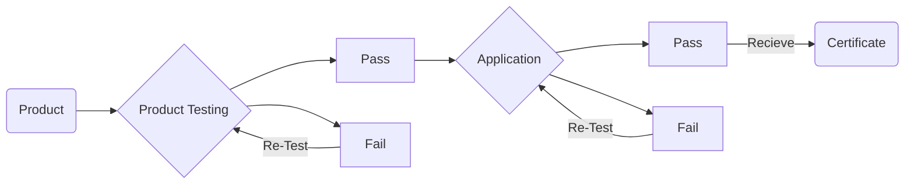

## Matter History

---

{: width="700" height="200" }
_Matter Mesh Network Example_

Matter was first announced in December of 2019 as CHIP (Project Connected Home over IP), a collaboration between Amazon, Apple, Google, Comcast, and the Zigbee Alliance. IKEA, Huawei, and Schneider are among the subsequent members, and the list continues to increase as additional companies throw their names into the hat. Now as the Matter code repository is open-source under the Apache licence, users can use it for any purpose, distribute it, edit it, and share updated copies of it without paying royalties. The Matter certification, on the other hand, is CSA licenced, but more on that later.

In 2022, Matter, a smart home protocol that aims to unify device communication across platforms, will be launched. This could happen as early as the first half of 2022, according to the Connectivity Standards Alliance, formerly known as the Zigbee Alliance.

Consumers can expect more consistent, secure connectivity and device compatibility thanks to this new industry standard. It's a guarantee that devices will function together effortlessly today and tomorrow. It will connect more objects, simplifying development for manufacturers and, as a result, lower consumer prices.

Now, let me clarify that last statement; if manufacturers' production is simplified, this should lower end-user costs; however, even if it doesn't, you can bet it will be cheaper when a company goes out of business and their product is no longer supported; you will still be able to use it, which means you won't have to re-invest any money to replace what you already have.

## What is Matter?

---

Matter is a brand-new method for smart home devices to communicate and connect. It's a wireless, IP-based mesh network technology similar to Z-wave and Zigbee. The goal is to establish a communication standard that does not confine your devices to certain hubs or smart home platforms. So, in principle, you'll be able to utilise Google Assistant, Apple Homekit, or Home Assistant with your Amazon devices or Philips Hue devices.

When Matter is launched, it will be compatible with Wi-Fi, Bluetooth LE, and Thread, a competing wireless mesh network protocol aimed at low-power battery-powered devices that Matter is based on. As a result, many of the companies mentioned above took the initial step by announcing Thread integration for their devices. This will allow them to use the Matter protocol, which enables them to work with a wider range of smart home systems, devices and voice assistants.

For the typical end-user, all of this may seem complex, but the bottom line is that smart home products will require Matter support to keep up with the future of the smart home industry.

## Certification at a Glance

---

{: w="700" h="300" }
_Matter Certification_

The certification process mainly consists of 2 stages: Product Testing & Application for Certificate

**Product Testing:** Upon successful testing, an application for a certificate, which is good for 10-years can be submitted. Once the application is approved the product gets immediately put into the Connectivity Standards Alliance database of [Certified Products.](https://csa-iot.org/csa-iot_products/)

- **Requirements:** Certification is only available to Connectivity Standards Alliance members. All new product certifications require product testing at a Connectivity Standards Alliance [Authorized Test Provider](https://csa-iot.org/certification/testing-providers/), followed by an application with the Connectivity Standards Alliance with their [Certification Tool.](https://csa-iot.org/certification/tools/certification-tool/)

- **Costs:** The primary costs associated with product certification are the testing and application fees.

So, if you're just getting started with smart home devices or adding more to your house, before you run out and buy any new devices check for Matter compatibility. It's going to... matter! Pun intended.
